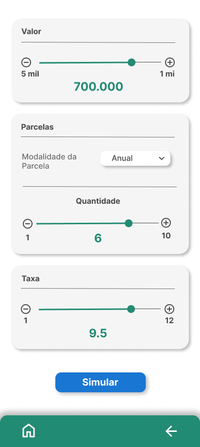
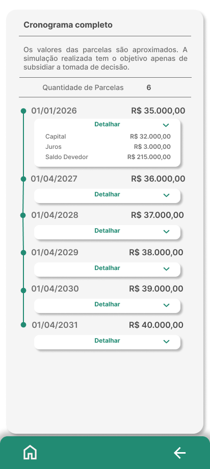

# SimulaPRONAF

**SimulaPRONAF** é um aplicativo Android desenvolvido para auxiliar agricultores familiares a simularem rapidamente condições de crédito rural com base no **PRONAF (Programa Nacional de Fortalecimento da Agricultura Familiar)**. Nesta versão MVP, o foco é oferecer uma simulação simples, intuitiva e acessível em duas telas principais.

## Objetivo

Fornecer uma ferramenta prática e confiável que permita ao agricultor visualizar o custo total e a viabilidade de um financiamento rural de forma rápida e descomplicada.

## Funcionalidades do MVP

- **Tela 1: Entrada de Dados**
    - Valor do financiamento
    - Taxa de juros anual
    - Quantidade de parcelas

- **Tela 2: Resultado da Simulação**
    - Valor do capital por parcela
    - Juros efetivos calculados com base em dias úteis (252)
    - Valor total por parcela 
    - Datas de vencimento das parcelas
    - Apresentação visual em cards informativos

## Tecnologias Utilizadas

- **Kotlin + Jetpack Compose** (UI moderna e declarativa)
- Arquitetura MVVM
- Theming personalizado com cores verde e branco
- Layout responsivo e acessível

## 🧭 Navegação do MVP

Abaixo, uma visualização da interface da funcionalidade **Simulação Rápida**, que representa o escopo inicial do projeto e constitui o **MVP (Produto Mínimo Viável)**. Essa tela permite que o usuário insira dados básicos como valor do crédito, taxa de juros anual e número de parcelas para obter uma simulação imediata e objetiva das condições de financiamento rural via PRONAF.

### 1. Tela de entrada de dados
O usuário informa o valor do crédito, a taxa anual e o número de parcelas:

### 2. Tela de resultados da simulação
Após calcular, os resultados são exibidos de forma clara e visual:

## 🛣️ Roadmap

### ✅ MVP (versão atual)
- [x] Tela de entrada de dados para simulação rápida
- [x] Layout com identidade visual (verde, branco, tipografia personalizada)
- [ ] Tela de exibição dos resultados em formato visual
- [ ] Cálculo das parcelas, apresentando capital, juros, saldo devedor
- [ ] Organização modular por features (Jetpack Compose)

### 🚧 Próximas etapas
- [ ] Tela de **cronograma detalhado** com datas reais de pagamento
- [ ] Implementação de **validação de dados** (ex: campos obrigatórios, limites numéricos)
- [ ] Adição de **animações suaves** ou microinterações com Compose

### 📡 Fase de expansão
- [ ] Simulação detalhada, abrangendo as diferentes **linhas do PRONAF** (como Custeio, Investimento, Mulher, Jovem, Agroecologia), com regras e condições específicas de cada modalidade.
- [ ] Integração com perfil do usuário (dados persistentes)
- [ ] Armazenamento seguro de simulações com Room (banco local)
- [ ] Exportar/Compartilhar resultado da simulação em PDF ou formato compartilhável
- [ ] Tela de ajuda/contexto com informações sobre o PRONAF
